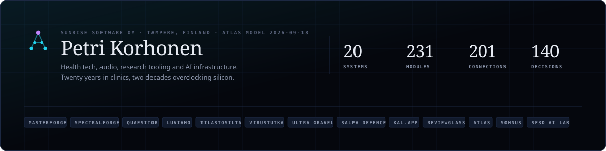
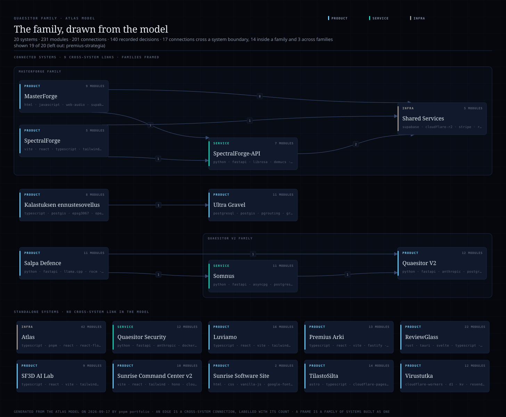

# Petri Korhonen

Founder of [Sunrise Software Oy](https://sunrisesoftware.app), an independent software studio in Tampere, Finland, established 2024.

Twenty years in clinical physiotherapy. Two decades of extreme overclocking under the alias SF3D. Now building software across health tech, audio, research tooling and AI infrastructure, and every tool I build is one I use daily.

Most of my repositories are private: client work and products that are not released yet. This page is the public description of what they contain, and the contribution graph counts the private ones.

## What I build

| Product | What it is | Where |
|---|---|---|
| MasterForge | AI music mastering built for the artifacts of neural-network audio. Real-time DSP engine, four tiers, paying customers since 2024. | [masterforge.app](https://masterforge.app) |
| SpectralForge | Companion to MasterForge: diagnoses and repairs the spectral deficiencies of AI-generated and codec-damaged audio. Beta. | [spectral.masterforge.app](https://spectral.masterforge.app) |
| Quaesitor | A research engine built around the cognitive stream: an agent reasons on its own, falsifies its claims, verifies them with code and computation, and refuses to repeat a question it cannot answer more strongly than before. Three specialised streams in parallel. | [quaesitor.app](https://quaesitor.app) |
| Luviamo | Marketing lifecycle platform for Nordic SMBs: one brand voice carried from ideation to publication and measurement, replacing five to eight separate tools. In production. | [luviamo.app](https://luviamo.app) |
| TilastoSilta | Finnish statistics, visualized and shareable, across public data sources with semantic search. | [tilastosilta.fi](https://tilastosilta.fi) |
| Virustutka | Open, login-free respiratory virus situation monitor and early warning for Finland, built on THL and ECDC open data. | [virustutka.app](https://virustutka.app) |
| Ultra Gravel | Finland-wide gravel route planner and navigator built on authoritative national geodata (MML topographic database, Digiroad) rather than OpenStreetMap. | app |
| Salpa Defence | A local AI appliance and software layer for environments cloud services cannot legally reach. Demo running, product in design. | private demo |
| kal.app | A falsifiable state model for stream fishing: where the fish is and when it feeds, from open data, on the device, with the forecast archived so its accuracy is shown to the user. | not yet released |
| ReviewGlass | Open source (Apache-2.0). A Windows 11 desktop companion for AI-assisted coding sessions: a magnifier glass over the session, a panel of every running session with the account quota, and later a live diff. Tauri v2, Rust core. | [github.com/Sunrisesoftware-app/reviewglass](https://github.com/Sunrisesoftware-app/reviewglass) |
| SF3D AI Lab | Research notes on multi-agent cognition running on AMD RDNA4 hardware: lab notes, negative results included, and a news feed assembled by agents. | [sf3d.fi](https://sf3d.fi) |

Also live: VitalTrack (personal training analytics, [health.sunrisesoftware.app](https://health.sunrisesoftware.app)). Day work: development manager at a rehabilitation company, where the staff application Arki (in production since August 2026) and the Premius Plus clinical platform are built in-house.

## How I work

The whole family is held in **Atlas**, a control plane of my own: one machine-readable model of every system, module, connection and decision, and every view derived from it. A React Flow viewer renders it. An MCP server serves it to Claude chat and to Claude Code, which are the pair I build with. Atlas Connect, a phone app, gives each project's partner the same picture: the timeline, the decisions that are theirs, what is waiting on whom. And a set of instruments keeps the model honest against the repositories: drift baselines between model and code, a render harness that draws a product in a pinned image and compares it to a committed baseline, a security lens over semgrep and osv-scanner with its own baselines, a mutation gate, and an idea funnel whose measurements are pre-registered before they run.

Rules that the instruments taught me, each paid for by a defect they caught:

- Only *unchanged* is a pass. A run that could not compare has not checked anything, and a gate that answers a slightly different question passes the very thing it exists to catch.
- An absence carries its cause, and a placeholder carries its status, in the type rather than in a comment. Otherwise a missing prediction reads as "nothing logged yet" and an unmeasured value reads as a measurement.
- A claim about the outside world is measured by calling it, and measured again before it is trusted. An injected fetch makes a module testable and blind to whether the URL is real.
- One subject is never enough to see an instrument's blind spot. The blind spot is where the instrument ends, and it takes a second product, a second corpus or a second model family to find it.
- I do not prototype. The first version ships, on a branch, through CI, squash-merged, with the decision written down as an ADR in the model.

## Infrastructure

- **Edge**: Cloudflare Workers and Pages, D1, R2, KV, Vectorize, Workers AI, Access.
- **Servers**: Hetzner, for what the edge cannot run: Postgres with PostGIS and pgrouting, GraphHopper, FastAPI services, stem separation and spectral DSP.
- **Somnus**, the home node: an always-on cognition layer for Quaesitor on two AMD GPUs, a Radeon AI PRO R9700 (32 GB) and a Radeon RX 7900 XT (20 GB), running llama.cpp on ROCm, reached over Tailscale. It generates candidate connections between concepts and falsifies them, around the clock, and its power and throughput are measured rather than assumed.
- **Managed**: Supabase, Stripe, Resend and the Anthropic API for the MasterForge family; Expo and React Native for the mobile apps.

## Before software

SF3D, 2006 to 2016: multiple world records in 3D and calculation benchmarks, the first 7 GHz quad-core CPU under liquid helium (2010), a SuperPi 32M world record (2012), HWBot Pro League world number three, and liquid-nitrogen cooling product lines co-designed with EK Water Blocks. The intuition built there, pressure, tolerance, the line between working and failing, is the one applied now to audio DSP, machine-learning outputs and clinical reasoning.

## Contact

pete@sunrisesoftware.app · [sunrisesoftware.app](https://sunrisesoftware.app) · Tampere, Finland

## The family, drawn from the model

The section below is generated from the Atlas model by `pnpm portfolio` and pasted here unchanged, so the numbers are measured rather than typed.

Measured from the model on 2026-09-24: 21 systems, 249 modules, 214 connections and 173 recorded decisions. 17 connections cross a system boundary; 14 of those stay inside a family and 3 cross families. The map shows 20 of the 21 systems (left out: premius-strategia).

| System | Type | Modules | Stack |
|---|---|---:|---|
| Atlas | infra | 45 | typescript, pnpm, react, react-flow, vite, tailwind, cloudflare-workers, d1, kv, cloudflare-access, mcp, oauth, web-tree-sitter, zod |
| Shared Services | infra | 5 | supabase, cloudflare-r2, stripe, resend, anthropic |
| Quaesitor Security | service | 12 | python, fastapi, anthropic, docker, mcp, semgrep, osv-scanner |
| Somnus | service | 11 | python, fastapi, asyncpg, postgresql, pgvector, llama.cpp, rocm, tailscale |
| SpectralForge-API | service | 7 | python, fastapi, librosa, demucs, bs-roformer, hetzner, nginx, systemd |
| HomeTeam | product | 15 | cloudflare-workers, durable-objects, d1, hono, zod, react, vite, typescript, pnpm, resend, web-push |
| Kalastuksen ennustesovellus | product | 8 | typescript, postgis, epsg3067, open-data, expo, react-native, maplibre |
| Luviamo | product | 16 | typescript, react, vite, tailwind, hono, cloudflare-workers, cloudflare-pages, d1, r2, kv, zod, vitest |
| MasterForge | product | 9 | html, javascript, web-audio, supabase-edge-functions, cloudflare-pages |
| Premius Arki | product | 13 | typescript, react, vite, fastify, postgresql, pgvector, wordpress, mariadb, caddy, docker-compose, mistral, entra-id |
| Quaesitor V2 | product | 12 | python, fastapi, anthropic, postgresql, pgvector, redis, tavily |
| ReviewGlass | product | 22 | rust, tauri, svelte, typescript, vite, windows-graphics-capture, notify, git, nsis |
| Salpa Defence | product | 11 | python, fastapi, llama.cpp, rocm, devstral, gemma, vibe-cli, uv, tailscale, postgresql, pgvector |
| SF3D AI Lab | product | 9 | typescript, react, vite, tailwind, hono, cloudflare-workers, cloudflare-pages, d1, kv |
| SpectralForge | product | 5 | vite, react, typescript, tailwind, zustand, cloudflare-pages |
| Sunrise Command Center v2 | product | 10 | vite, react, tailwind, hono, cloudflare-workers, d1, r2, cloudflare-access, anthropic |
| Sunrise Software Site | product | 2 | html, css, vanilla-js, google-fonts, cloudflare-pages |
| TilastoSilta | product | 14 | astro, typescript, cloudflare-pages, cloudflare-workers, d1, vectorize, workers-ai, resvg-wasm, vitest |
| Ultra Gravel | product | 11 | postgresql, postgis, pgrouting, graphhopper, java, node, fastify, typescript, react, react-native, expo, vite, maplibre, cloudflare-workers, cloudflare-pages, d1, kv, hetzner, docker, python |
| Virustutka | product | 12 | cloudflare-workers, d1, kv, resend, pnpm, typescript, vite, react |
